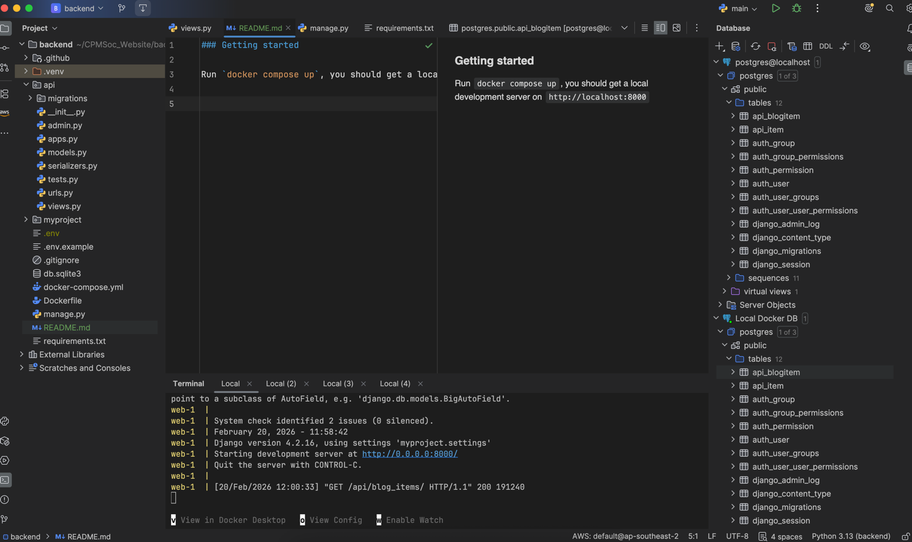
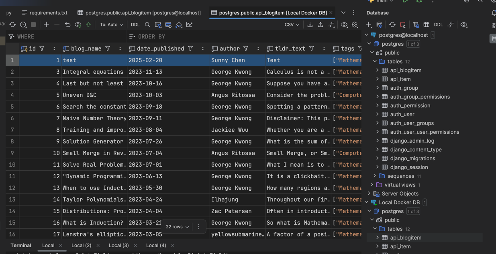
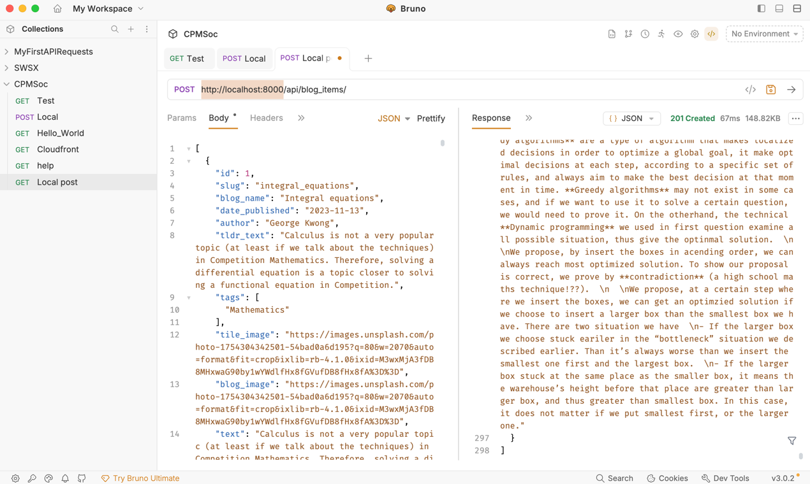

### Getting started

Run `docker compose up`, you should get a local development server on `http://localhost:8000`. Use control-c or docker compose down to close.


_I'm using PyCharm but any IDE will do_

I recommend using an IDE and the local database connector options. In this case on the right
I have access to the database running in production, and a local Docker database for testing. This makes it easy to add new
blogs if you don't want to use the REST requests.



If you need to run migrations for the database use
```
docker compose exec web python manage.py makemigrations
docker compose exec web python manage.py migrate
```

Here are some of the requests in the backend:
```
GET /api/hello_world/ - To check its working

GET /api/blog_items - Get all blog items in a list from newest to oldest
GET /api/blog_items/shortened - Get all blog items newest to oldest, excluding the text field (which is very big)

POST /api/blog_items - Add blog items, payload as a list or just single JSON

GET /api/blog_items/by_name/{blog_name} - Get a blog by its name
GET /api/blog_items/by_id/{id} - Get a blog by its ID
GET /api/blog_items/by_slug/{slug}/ - Get a blog by its slug
GET /api/blog_items/filter_by_tags/?tags=Math&tags=Science - Get all blogs with a specific tag(s)
GET /api/blog_items/get_next_by_slug/{slug}/ - Get the next blog (based on chronological order, will loop around on the oldest blog to the newest blog)

DELETE /api/blog_items/{id} - Delete a blog by its ID
```

If you need to copy paste blogs between servers, I'd do the following
```
curl -X GET -H "Origin: http://localhost:4173" <BASE_URL>/api/blog_items/ | jq '.' > CPMSoc_Blogs.txt
```
Then copy the output from the txt file and place it into Postman or equivalent and do the relevant `POST` request with that as the payload.



I usually host on an EC2 instance, but since its dockerised it should work on any general cloud provider :)

For CORS, you'll need to want to allow the actual URL the website is hosted on. Look at `.env.example`.

There's CI/CD pipelines if you go `github > workflows > deploy.yml`, setup for Amazon EC2. Though if you use a different cloud provider
feel free to change this. You'll need to place the relevant secrets in the github repository.